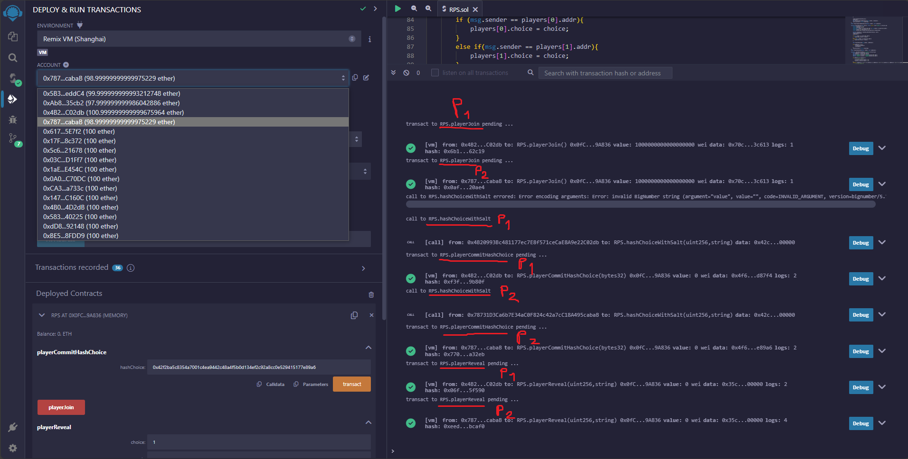
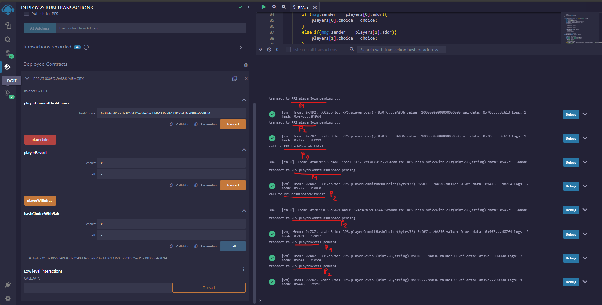

# RWAPSSF

## Problem

1. ไม่มีใครอยากจะเลือกก่อน เพราะว่ากลัวถูกอีกคนทำ front-running (การได้ประโยชน์จากการรู้ล่วงหน้าว่าคนหนึ่งเลือกอะไร)
2. ยากต่อการจะรู้ว่าเราใคร account ไหนเป็น idx ที่ 0 หรือ 1
3. เงินของ player 0 อาจถูกล๊อกไว้ ถ้าไม่มี player 1 มาลงขันต่อ
4. กรณีได้ player ทั้ง 2 แล้ว แต่มีเพียง player เดียวที่ลง choice มา แต่อีก player ไม่ยอมเรียก input function เพื่อส่ง choice มาให้ smart contract ได้ตัดสินแพ้ ชนะ เสมอ เช่นนี้ทำให้เงิน ETH ของทุกคนที่ลงขันมาถูกล็อกไว้โดยไม่มีใครถอนออกมาได้
5. ทำยังไงให้ contract นี้(มีการ transact กับมัน) ได้ในหลายๆ รอบโดยที่ไม่ต้องมีการ deploy ใหม่เสมอในทุกๆครั้งที่ต้องการเล่น
6. เล่น

## Solution

1. (Done) Use commitment to protect front-running
   - Player commit their choice by hash it by function `hashChoiceWithSalt(choice, salt)`
   - When both player commit their choice, they reveal their choice and salt and compare it with their commitment then get winner
2. (Done) Use account address instead idx 0 or 1
   - Use `msg.sender` to get player instead of using idx
   - So player not need to know their idx
3. (Done) Use timer to protect lock
   - If player 1 not play in time, player 0 can call `playerWithdraw` to get their money back
   - But if other player reveal their choice, player can't withdraw their money
4. (Done) Restart game when game finish
   - When game finish, reset all game state to initial state

## Additional

1. (Done) Rock Water Air Paper Sponge Scissors Fire (7 elements)
   - Add more elements and change winner logic

## Example

### Player 1 win and player 2 lose

### Draw

